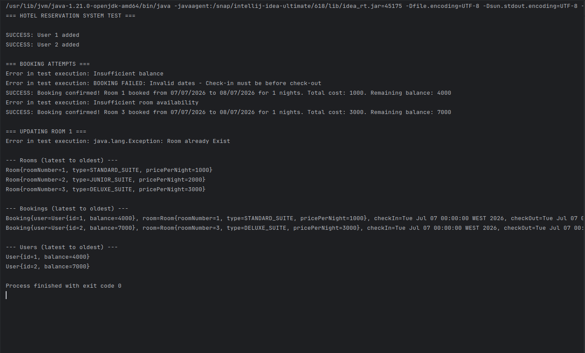

# Hotel Reservation System

## Table of Contents
- [Overview](#overview)
- [Project Structure](#project-structure)
- [Requirements](#requirements)
- [Installation](#installation)
- [Usage](#usage)
- [Entities](#entities)
- [API Reference](#api-reference)
- [Test Cases](#test-cases)
- [Design Questions](#design-questions)
- [Contributing](#contributing)
- [License](#license)

## Overview

A Java-based hotel reservation system implementing core booking functionality with room management, user balance tracking, and reservation validation. This project fulfills the requirements of Skypay Technical Test 2.

### Features
- Room management with different types and pricing
- User account management with balance tracking
- Booking system with comprehensive validation
- Exception handling for all operations
- Complete JUnit test suite

## Project Structure

```
hotel-reservation-system/
├── src/
│   ├── main/java/
│   │   ├── org/example/
│   │   │   └── Main.java
│   │   ├── org/example/entities/
│   │   │   ├── User.java
│   │   │   ├── Room.java
│   │   │   ├── Booking.java
│   │   │   └── RoomType.java
│   │   └── org/example/services/
│   │       └── Service.java
│   └── test/java/
│       └── org/example/services/
│           └── ServiceTest.java
├── README.md
└── pom.xml
```

## Requirements

- Java 8 or higher
- JUnit 5 (for testing)
- Any Java IDE (IntelliJ IDEA, Eclipse, VS Code)

## Installation

1. **Clone the repository**
```bash
git clone <repository-url>
cd hotel-reservation-system
```

2. **Import into your IDE**
- Open your Java IDE
- Import as a Java project
- Ensure proper package structure

3. **Verify setup**
```bash
javac src/org/example/Main.java
java -cp src org.example.Main
```

## Usage

### Basic Example

```java
// Create service instance
Service service = new Service();

// Create rooms
service.setRoom(1, 1000, RoomType.STANDARD_SUITE);
service.setRoom(2, 2000, RoomType.JUNIOR_SUITE);

// Create users
service.setUser(1, 5000);
service.setUser(2, 10000);

// Make booking
SimpleDateFormat sdf = new SimpleDateFormat("dd/MM/yyyy");
Date checkIn = sdf.parse("07/07/2026");
Date checkOut = sdf.parse("08/07/2026");
service.bookRoom(1, 1, checkIn, checkOut);

// View results
service.printAll();
service.printAllUsers();
```

### Running Tests

```bash
# Run all unit tests
mvn test

# Or run specific test class
java -cp "src:junit-platform-console-standalone.jar" org.junit.platform.console.ConsoleLauncher --scan-classpath
```

## Entities

### User
```java
public class User {
private int id;              // Unique identifier
private int balance;         // Available balance
}
```

### Room
```java
public class Room {
private int roomNumber;      // Unique room identifier
private int pricePerNight;   // Cost per night
private RoomType roomType;   // Room category
}
```

### Booking
```java
public class Booking {
private int roomNumber;      // Booking identifier
private User user;           // User snapshot
private Room room;           // Room snapshot
private Date checkInDate;    // Check-in date
private Date checkOutDate;   // Check-out date
private int nights;          // Number of nights
}
```

### RoomType
```java
public enum RoomType {
STANDARD_SUITE,
JUNIOR_SUITE,
DELUXE_SUITE
}
```

## API Reference

### Service Methods

#### `setRoom(int roomNumber, int pricePerNight, RoomType roomType)`
Creates a new room.

**Parameters:**
- `roomNumber` - Unique room identifier
- `pricePerNight` - Cost per night
- `roomType` - Room category

**Throws:**
- `RuntimeException` - If room already exists
- `Exception` - If duplicate type/price combination

#### `setUser(int userId, int balance)`
Creates a new user.

**Parameters:**
- `userId` - Unique user identifier
- `balance` - Initial balance

**Behavior:** Ignores duplicate user IDs

#### `bookRoom(int userId, int roomNumber, Date checkIn, Date checkOut)`
Creates a booking with validation.

**Parameters:**
- `userId` - User identifier
- `roomNumber` - Room identifier
- `checkIn` - Check-in date
- `checkOut` - Check-out date

**Throws:**
- `Exception` - Various validation failures

#### `printAll()`
Displays all rooms and bookings.

#### `printAllUsers()`
Displays all users.

## Test Cases

### Setup Data
- **Room 1:** STANDARD_SUITE, 1000/night
- **Room 2:** JUNIOR_SUITE, 2000/night
- **Room 3:** DELUXE_SUITE, 3000/night
- **User 1:** Balance 5000
- **User 2:** Balance 10000

### Test Scenarios

| Test | Description | Expected Result |
|------|-------------|----------------|
| 1 | User 1 books Room 2 (7 nights) | ❌ Insufficient balance |
| 2 | User 1 books Room 2 (invalid dates) | ❌ Invalid date range |
| 3 | User 1 books Room 1 (1 night) | ✅ Success |
| 4 | User 2 books Room 1 (2 nights) | ❌ Room conflict |
| 5 | User 2 books Room 3 (1 night) | ✅ Success |
| 6 | Update Room 1 | ❌ Room exists |

### Results
<p align="center">
  
</p>
### JUnit Tests
The project includes 11 comprehensive test cases covering:
- User creation and validation
- Room creation and duplicate handling
- Booking validation and business rules
- Exception scenarios

## Design Questions

### 1. Single Service Approach

**Question:** Is putting all functions in the same service recommended?

**Answer:** No, not recommended for production systems.

**Issues:**
- Violates Single Responsibility Principle
- Difficult to test individual components
- Tight coupling between concerns
- Hard to maintain and scale

**Better Approach:**
```java
UserService userService;     
RoomService roomService;      
BookingService bookingService; 
```

**Benefits:**
- Better separation of concerns
- Easier unit testing
- More maintainable code
- Follows SOLID principles

### 2. Room Update Impact

**Question:** Current design doesn't impact previous bookings. What's another way and your recommendation?

**Current Approach:** Snapshot pattern - bookings preserve room/user data at booking time

**Alternatives:**

1. **Reference-Only Pattern**
- Store only IDs in bookings
- Changes affect all bookings
- Pros: Simple, consistent
- Cons: Historical data changes

2. **Versioning Pattern**
- Keep room history
- Reference specific versions
- Pros: Complete audit trail
- Cons: Complex structure

3. **Event Sourcing**
- Store all changes as events
- Rebuild state from events
- Pros: Complete history
- Cons: Complex implementation

**Recommendation:** Keep current snapshot approach

**Justification:**
- Preserves booking integrity
- Prevents billing disputes
- Meets business requirements
- Simple to implement and understand
- Customers expect booking details to remain unchanged
